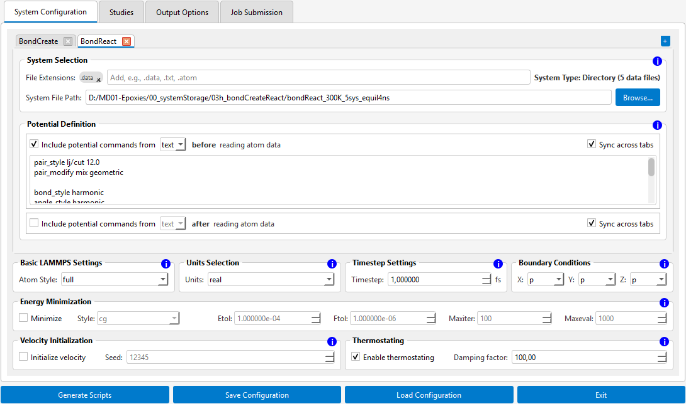
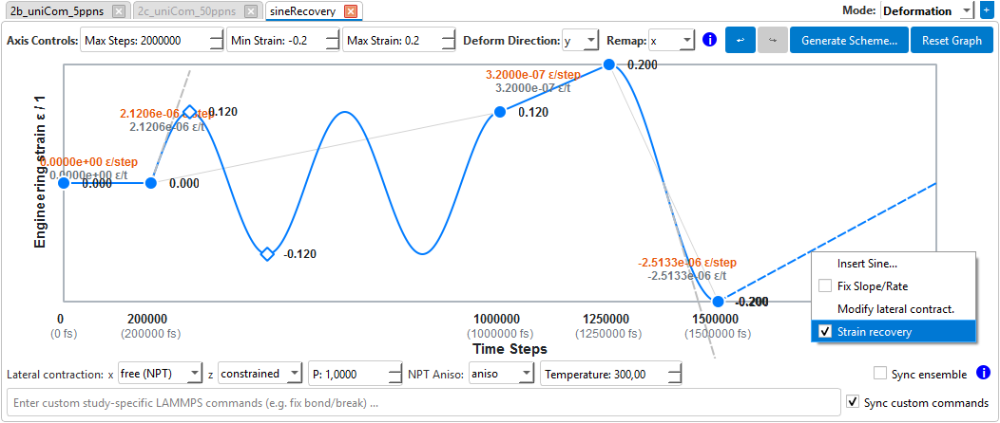

# LAMMPSdeformer

Build LAMMPS input scripts for molecular dynamics deformation and temperature-profile simulations through a GUI.
You draw strain or temperature profiles over time on an interactive graph, configure your systems, outputs, and cluster submission.
The tool generates a complete simulation package with restart support (LAMMPS scripts, run scripts, SLURM job).

## Features

- **Multiple data sets:** one or more atom data variants/samples per run, each with its own data file or folder and its own potential settings.
- **Draw your loading profile:** drag handles and segments right on the graph (linear ramps or sine waves) or generate staircase, cyclic or sinusoidal schemes via one dialog.
Lock slopes/rates, freeze deformation points, undo/redo.
- **Two study modes:** `Deformation` (strain profiles via `fix deform`, lateral axes free or constrained) and `Temperature` (temperature ramps via `fix nvt/npt/nve/nph`); combine both as separate studies in one project.
- **Custom logging:** choose what gets thermo logged and how often: either "every N steps" or "exactly N times per study/simulation".
Add strains, stresses, and running averages on top of standard thermo output quantities.
- **Machine independence:** start everything locally via one run script (Linux/windows/MacOS), or submit to a SLURM cluster.
Long cluster runs checkpoint themselves and resume automatically before the walltime runs out.
- **Reproducible:** every generated package includes a loadable settings file that fully describes the run, and the app remembers your setup between sessions.

## Requirements & Installation

- Python 3.9 or newer (tested with 3.12)
- PyQt6:
  - **Ubuntu / Debian:** `sudo apt install python3-pyqt6` (or alternatively via `venv` and the macOS/Win command:)
  - **macOS / Windows:** `pip install -r requirements.txt`
- LAMMPS 30Mar2026 or newer to run the generated scripts (due to the `flip` keyword in `fix nvt/npt/nph`).

## Quickstart

```bash
python run_gui.py      # on Linux/macOS: python3 run_gui.py
```

Fill four settings tabs and auto-generate the scripts:

1. **System Configuration:** point to an atom data file or a folder containing multiple; units and atom style are detected and prefilled automatically.
2. **Studies:** shape the strain or temperature ramp (or use `Generate Scheme...`), pick a deformation axis (x, y, z, volumetric, or shear xy/xz/yz; tension vs. compression via the strain sign), lateral axis behavior, and temperature.
3. **Output Options:** set an output folder and pick the logged quantities for thermo and trajectory output.
4. **Job Submission:** keep the local defaults, or enter your cluster/SLURM details and restart settings.
5. Click **Generate Scripts** and review the summary dialog.

## GUI

### Tab 1: System Configuration



- **Data set tabs:** Double-click renames (letters, numbers, `_`, `-`); the right-click menu offers copy, rename, and activation.
With several data set tabs, results are organized per tab.
Deactivated sets stay in your saved setup but sit out the next script generation; reactivate them anytime.
- **System selection:** Enter one path for a data file or a folder for multiple data file samples, filtered by `File Extensions` items (default `.data`).
The app reads and enters units and atom style from the data file automatically.
- **Potentials:** In generated scripts, "before" applies potentials ahead of reading the atom data, "after" applies once data and box are set up.
With several data sets tabs, `Sync across tabs` keeps entered potentials identical everywhere.
- **Energy minimization:** If active, runs once at the start, before velocities are assigned and time step is reset.
- **Velocities:** If active, seeds initial velocities at the ensemble temperature (or the profile's first point in Temperature mode).

### Tab 2: Studies (profile editor)

Create deformation or temperature profiles:



- **Study tabs:** Add an arbitrary number of deformation/temperature studies.
Double-click renames; the right-click menu offers copy, rename, and activation.
Deactivated studies sit out the script generation; reactivate them anytime.
- **Mode:** Switch between a `Deformation` or a `Temperature` study per tab.
- **Drawing the profile:** Create and drag the round handles or segments to define the strain/temperature profiles across the time steps (hold `Shift` to move in only one direction).
Double-click to add a point/handle in empty space or on an existing segment.
The right-click handle menu offers numerical coordinate (strain/temperature/time step) entry, freezing, and deletion; the segment menu offers line/sine conversion, slope freezing, per-segment lateral deformation settings and (on the last segment) strain recovery.
Right-click a slope label to freeze that segment's slope, right-click an axis label to freeze a point's time or value (frozen items turn red); frozen slopes remain when you move neighboring points.
- **Edit numbers:** Double-click any value, step, slope, or rate label to type an exact value.
- **Sine segments:** Any segment allows switching from a straight line to an alternating or pulsating sine wave with adjustable cycles.
The diamond handle on the curve sets the amplitude by dragging; the dashed tangent shows the peak loading rate.
- **Ensembles and lateral contraction:** Each lateral axis can be switched between constrained and free (NPT), either for the whole study or per segment (right-click menu); `Sync ensemble` copies the global lateral settings to all same-mode study tabs.
- **Strain recovery:** the last segment can be switched to free recovery, i.e., the deformation direction is subjected to NPT conditions.
- **Preset generator:** `Generate Scheme...` builds staircase, linear cyclic/triangular, or sinusoidal profiles from a few parameters.
- **Custom commands per study:** Extra LAMMPS lines (for example bond-breaking fixes), optionally synced across study tabs.
- **Undo/redo:** `Ctrl+Z`/`Ctrl+Y`, tracked separately per study and mode.

Holding strain constant lets stresses relax (stress relaxation) and free unloading is covered by strain recovery.
Besides, stress-controlled loading of the deformation axis and (constant-stress) creep is not (yet?) supported.

### Tab 3: Output Options

- **Output folder:** Define (recommended) or leave it empty to default to the first data file's folder.
- **Thermo (log) output:** `Frequency` logs every N steps across all studies; `Count` logs N lines per study (calculates the frequency for each study independently).
Strain and stress items can be activated if deformation mode is used in any study; Temperature studies can append the target temperature as a column.
Strains are dimensionless; stresses come in the pressure unit of the selected units system (bar for metal, atm for real, Pa for si, etc.).
The `Average` row averages chosen quantities over time, keeping the sampling combination of `fix ave/time` valid.
- **Trajectory output:** Also as `Frequency` or `Count`, letting you choose from all LAMMPS-available output quantities.

<table>
<tr>
<td>💡 <strong>Hint:</strong> Simulation output generated using scripts from <strong>LAMMPSdeformer</strong> can be easily visualized and analyzed with <strong><a href="https://github.com/LukasLaubert/LMPvisualizer">LMPvisualizer</a></strong>.</td>
</tr>
</table>

### Tab 4: Job Submission

- **Local runs:** Single-processor or multiprocessor; the OS choice decides whether you get a `.bat` or `.sh` run file.
- **Cluster runs:** Start all studies based on a single submission file.
Automatic restart checkpoints the run, requeues itself before the runtime limit, and resumes exactly where it stopped, even mid-(sine)-profile.

The bottom bar generates, saves, and loads setups; validation runs first and tells you exactly what to fix: tab and file names, all data and potential files in place, matching units across data files, profile points aligned with the averaging rhythm, and a choice for non-empty output folders (delete contents / overwrite / abort).

## Generation

```
<output_folder>/
  base_input.in                 # shared settings (units, timestep, strain/stress definitions)
  _input_files/                 # copies of your .data and potential files
  <study>/<system>/<model>.in   # one ready-to-run LAMMPS script per study x data file
  local_run_all.bat | .sh       # starts every simulation locally on Linux/Mac/Windows
  lammps_simulation.job         # cluster job file (requeues itself when restart is on)
  cluster_run_all.sh            # submits all models to the queue
  LAMMPSdeformer_settings.json  # session file to reload the settings used for this generation
```

## Long runs & restarts

With automatic restart switched on, a simulation is split into checkpoint chunks.
Each chunk saves the full simulation state.
The simulation stops whenever the next chunk outlasts the remaining job time and submits a follow-up job that continues seamlessly, preserving thermostat and barostat state.

## All settings safe

LAMMPSdeformer writes a safety `.json` session backup every 30 seconds and on crashes.
If the app did not close cleanly, the backup is offered for restore on the next start.
Use **Save/Load Configuration** (bottom bar) to name and save a session file to a custom file path.
On simulation input generation, a `LAMMPSdeformer_settings.json` is created (can be renamed) to reload or share the exact run settings.

## License

MIT License, Copyright (c) 2026 Lukas Laubert.
See `LICENSE`.